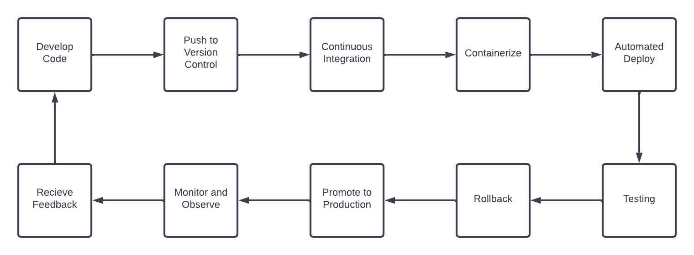

# Project 5
## 5.1 - Semantic Versioning
### CD Project Overview
> The Continuous Delivery (CD) project efficently supplies software through automated processes using Git and GitFlow for version control and branching respectively. Docker and Github actions are used to build, test, and deploy changes. Many tests are included in the CD pipeline. The goal is to creatue and agility based software development environment that has iterative enhancements. 

### How to generate a tag in Git

1. Navigate to Respository in command line,
2. Choose the commit to tag,
3. Create the tag using git tag [tag_name],
4. Push to remote host

### How to generate a tag in GitHub

1. Navigate to Respository,
2. Go to "Releases" tab,
3. Draft a new release,
4. Fill the release form and Publish the release

### Behavior of GitHub workflow

#### The GitHub Workflow only triggers when:
* a push to the main branch happens
* a tag event matches the version pattern [v #.#.# ]
* a pull request targets the main branch

#### The Github Workflow does the following:
* Checkout the repository's code
* set up cross platform Docker Builds
* Generate Docker tags based on metadata
* Logs into Dockerhub using the login secrets
* Builds and Pushes the Docker images to dockerhub using the given tags

### Link to Docker Hub repository (as additional proof)

["CEG 3120 DockerHub Repository"](https://hub.docker.com/repository/docker/theno2milk/ceg3120/general)

## 5.2 - Deployment

### How to install Docker to your instance

1. Connect to Your EC2 Instance
2. Update your software packages
> sudo apt update
3. Install some pre-requisite packages
> sudo apt install -y apt-transport-https ca-certificates curl software-properties-common
4. Install Docker
> sudo apt install docker-ce

### Container restart script
#### Justification & description of what it does
* This script is used to reset all running Docker containers on the system.
   * First, it checks if Docker is installed on the system
   * If it isn't, the program exits with an error message
   * If it is, then it will list and then restart any running containers
 
#### Where it should be on server
* This should be stored with any other admin level scripts on the instance.
* I currently will be storing it in the 'scripts' directory

### Setting up a webhook listener on the instance
#### How to install adnanh's webhook to the instance

1. Install Webhook
> sudo apt-get install webhook
2. Create a hooks.yaml file
3. Put the following in that yaml file
> - id: redeploy-webhook
  execute-command: "/var/scripts/redeploy.sh"
  command-working-directory: "/var/webhook"
4. Run Webhook
> webhook_path -hooks hooks.yaml -verbose

### Webhook Task Definition File
#### Description of what it does
* This file describes an endpoint /webhook that listens for HTTP POST requests with Json or yaml payloads.
* It expects a json or yaml object with a secret field in the request body. Upon receiving a request, it executes a given bash script
* It also responds with an HTTP status code of 200 along with a body indicating successful processing.
#### Where it should be on the instance (if someone were to use your setup)
> I currently will be storing it in the 'scripts' directory

### How to start the webhook
1. cd into the webhook directory
2. start the webhook service
> webhook -hooks hooks.yaml -verbose

### How to modify/ create a webhook service file such that your webhook listener is listening as soon as the system is booted
* edit the webhook.service file at /etc/systemd/system/webhook.service
> Add the following:
> [Unit]
  Description=Webhook Listener
  After=network.target

  [Service]
  ExecStart=/usr/local/bin/webhook -hooks hooks.yaml_path -verbose
  WorkingDirectory=webhookDirectory_path
  Restart=always
  RestartSec=3

  [Install]
  WantedBy=multi-user.target
* reload the system and start webhook
> sudo systemctl daemon-reload & sudo systemctl start webhook
* Enable Startup on boot
> sudo systemctl enable webhook
#### Commands to reload the service if files change
1. Run: sudo nano /etc/systemd/system/webhook.path
2. Add this code to the file
> [Unit]
  Description=Watch for webhook service and hook definition file changes

  [Path]
  PathModified=/etc/systemd/system/webhook.service
  PathModified=/path/to/hooks.json

  [Install]
  WantedBy=multi-user.target
3. reload system and start webhook.path
> sudo systemctl daemon-reload & sudo systemctl start webhook.path

### How to configure GitHub to message the listener
1. Go to Repository's Settings page
2. Find and access the 'Webhooks' page from the Repository's Settings page
3. Select the 'Add' or 'Create' Webhook
4. Enter the URL of the listener endpoint into the Payload URL field
5. Select which events will trigger the webhook
6. Save the webhook's configuration

### Diagramming
### 

RESOURCES USED
https://cd.foundation

https://github.com/adnanh/webhook

https://git-scm.com/book/en/v2/Git-Basics-Tagging

https://docs.github.com/en/desktop/managing-commits/managing-tags-in-github-desktop

https://www.linkedin.com/pulse/docker-installation-aws-ec2-instance-nandhini-saravanan/
